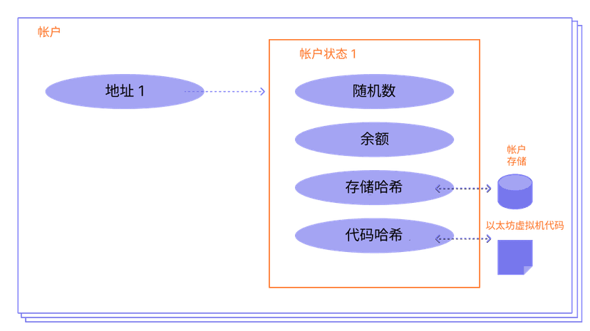
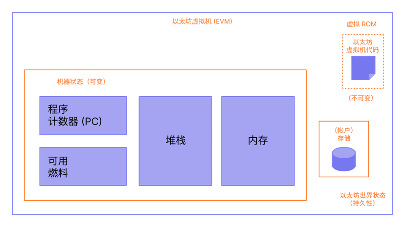
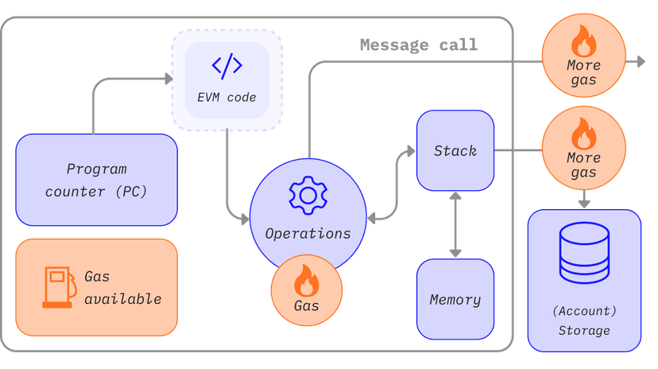
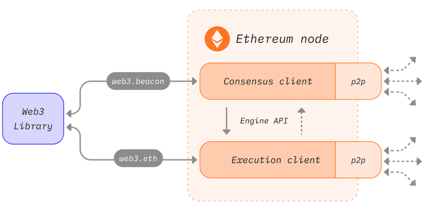

# 以太坊

## 以太币

### 什么是以太币？

**以太币 (ETH)** 是以太坊上的原生加密货币。 以太币的目的是允许计算市场化。 这种市场为参与者提供了一种经济激励，以验证并执行交易请求，为网络提供计算资源。

任何广播交易请求的参与者还必须向网络提供一定数量的以太币作为奖金。 网络将把这种奖金奖励给最终验证交易、执行交易、将其提交到区块链并广播到网络的任何人。

支付的以太币数量对应于进行计算所需的资源。 这类奖励也可以阻止恶意参与者通过请求执行无穷计算或其他资源密集型脚本来故意堵塞网络，因为这些参与者必须为计算资源付费。

以太币还用于通过以下三种主要方式为网络提供加密经济安全性：1) 作为一种奖励方式，奖励提议区块或指出其他验证者不诚实行为的验证者；2) 由验证者抵押，作为遏制不诚实行为的抵押品 — 如果验证者试图行为不端，它们的以太币可能会被销毁；3) 用于对新提议的区块的“投票”进行加权，并影响共识机制的分叉选择部分。

### 铸造 ETH

铸造是指在以太坊分类账上创造新以太币的过程。 底层以太坊协议创造出新以太币，单一用户不可能创造。

以太币铸造出来，用来奖励提议的每个区块，以及在每个时段的检查点奖励验证者执行的和达成共识有关的其他活动。 总发行量取决于验证者的数量和它们质押的以太币数量。 在所有验证者都诚实且在线的理想情况下，以太币总发行量会在所有验证者中等分，但现实中分配情况会因验证者的表现而异。 总发行量的大约 1/8 会奖励给区块提议者，剩余部分在其它验证者中分配。 区块提议者还会获得交易费小费和矿工可提取价值，但这些都来自流通中的以太币，而非新发行的以太币。

### 燃烧 ETH

除了通过区块奖励创建以太币，以太币也能通过“燃烧”过程销毁。 当 ETH 被燃烧掉，它也就永久退出流通。

以太坊上的每一笔交易都会发生以太币销毁。 当用户为他们的交易支付费用时，网络根据交易需求设置的基础燃料费会被销毁。 以太币销毁再加上可变区块大小和最高燃料费，简化了以太坊上的交易费估算。 网络需求量高时，[区块(opens in a new tab)](https://etherscan.io/block/12965263)燃烧的以太币数量可以多于铸造的以太币数量，有效地抵消了以太币的发行。

销毁基础费抑制区块生产者操纵交易的能力。 例如，如果区块生产者获得了基础费，他们可以免费添加自己的交易，并提高其他所有人的基础费。 或者，矿工可以将基础费退还给一些链下用户，造成交易费市场更加不透明和复杂。

### 传输 ETH

以太坊上的每笔交易都包含一个 `value` 字段，指定从发送者地址发送到接收者地址的以太币转账金额（以 Wei 为单位）。

当接收者地址是[智能合约](https://ethereum.org/zh/developers/docs/smart-contracts/)时，在智能合约执行其代码后，这些转账的以太币可用于支付燃料费用。

### 查询 ETH

用户可以通过检查帐户的 `balance` 字段来查询任何[帐户](https://ethereum.org/zh/developers/docs/accounts/)的以太币余额，该字段显示以太币持有数量（以 Wei 为单位）。

## DAPP

### DAPP 的定义

一个 dapp 的后端代码在一个去中心化 P2P 网络上运行。 与此相对应的，是在中心化服务器上运行后端代码的应用程序。

dapp 可以用任何语言编写（就像是一个 app）。它有前端代码和用户界面，能调用其后端。 此外，它的前端可以托管在去中心化存储上，例如 [IPFS(opens in a new tab)](https://ipfs.io/)。

- **去中心化** - dapp 在以太坊上运行，这是一个开放的公共去中心化平台，没有任何一个人或团体可以控制
- **确定性** ，无论执行的环境如何，都执行相同的功能
- **图灵完备** - dapp 可以根据所需资源执行任何操作
- **隔离性** - 它们在称为 EVM 的虚拟环境中执行。即使智能合约出现问题，也不会妨碍区块链网络的正常运行

### 智能合约

要引入 dapp，我们需要引入智能合约 —— dapp 的后端，因为缺少更好的术语。 有关详细概述，请访问我们的[智能合约](https://ethereum.org/zh/developers/docs/smart-contracts/)部分。

智能合约是一种在以太坊网络上的计算机程序，它严格按照事先编写的代码来运行。 智能合约一旦部署到以太坊网络中，就无法更改。 Dapps 可以是去中心化的，就是由于它们受智能合约的既定逻辑控制，而不是个人或公司。 这也意味着你需要非常仔细地设计合约，并进行全面测试。

## 账户

### 帐户类型

以太坊有两种帐户类型：

- 外部所有的帐户 (EOA) – 由任何拥有私钥的人控制
- 合约帐户 – 部署到网络上的智能合约，由代码控制。 了解[智能合约](https://ethereum.org/zh/developers/docs/smart-contracts/)。

这两种帐户类型都能：

- 接收、持有和发送 ETH 和 token
- 与已部署的智能合约进行交互

**主要区别**

**外部持有**

- 创建帐户是免费的
- 可以发起交易
- 外部所有的帐户之间只能进行以太币和代币交易
- 由一对加密密钥组成：控制帐户活动的公钥和私钥

**合约**

- 创建合约存在成本，因为需要使用网络存储空间
- 只能在收到交易时发送交易
- 从外部帐户向合约帐户发起的交易能触发可执行多种操作的代码，例如转移代币甚至创建新合约
- 合约帐户没有私钥。 相反，它们由智能合约代码逻辑控制

### 理解帐户

以太坊帐户有四个字段：

- `nonce` - 一个计数器，用来显示外部帐户发送的交易数量或合约帐户创建的合约数量。 每个帐户只能执行具有一个给定随机数的一笔交易，以防范重放攻击，重放攻击指多次广播和重复执行已签署的交易。
- `balance` – 这个地址拥有的 Wei 数量。 Wei 是以太币的计数单位，每个 ETH 有 1e+18 个 Wei。
- `codeHash` - 该哈希表示以太坊虚拟机 (EVM) 上的帐户*代码*。 合约帐户具有编程的代码片段，可以执行不同的操作。 如果帐户收到消息调用，则执行此 EVM 代码。 与其他帐户字段不同，不能更改。 所有代码片段都被保存在状态数据库的相应哈希下，供后续检索。 此哈希值称为 codeHash。 对于外部所有的帐户，codeHash 字段是空字符串的哈希。
- `storageRoot` – 有时被称为存储哈希。 Merkle Patricia trie 根节点的 256 位哈希已编码了帐户的存储内容（256 位整数值映射），并编码为 Trie，作为来自 256 的 Keccak 256 位哈希的映射位整数键，用于 RLP 编码的 256 位整数值。 此 Trie 对此帐户存储内容的哈希进行编码，默认情况下为空。




## 密钥、地址

以太坊有两种不同类型的账户，可以拥有和控制ether：*外部所有账户*（EOA）和_合同_

EOAs中以太的所有权通过 *数字密钥* *digital keys*，*以太坊地址_和_数字签名* 建立 。数字密钥实际上并不存储在区块链中或在以太坊网络上传输，而是由用户创建并存储在文件或称为_钱包_的简单数据库中。用户钱包中的数字密钥完全独立于以太坊协议，可以由用户的钱包软件生成和管理，无需参考区块链或访问互联网。数字密钥可实现以太坊的许多有趣特性，包括去中心化的信任和控制以及所有权证明。

数字密钥成对组成，密钥和公钥。将公钥视为类似于银行帐号，私钥类似于私密PIN，用于控制帐户。以太坊的用户很少看到这些数字密钥。在大多数情况下，它们存储在钱包文件内并由以太坊钱包软件管理。

在以太坊交易的付款部分中，预期收款人由_以太坊地址_表示，该地址与支票上的收款人名称相同（即“付款给谁”）。在大多数情况下，以太坊地址是从公钥生成并对应的。但是，并非所有以太坊地址都代表公钥。他们也可以代表合同，我们将在 [[contracts\]](https://github.com/inoutcode/ethereum_book/blob/master/第五章.asciidoc#contracts) 中看到。以太坊地址是用户常会看到的唯一密钥表示，因为这是他们需要与世界分享的部分。

### 公钥密码技术和加密货币

公钥密码系统使用唯一的密钥来保护信息。这些独特的密钥基于具有独特属性的数学函数：它们很容易在一个方向上计算，但很难在相反方向上计算。基于这些数学函数，密码学能够创建数字密钥和不可伪造的数字签名，这些签名由数学定律保证。

在密码学中有用的一类数学函数基于椭圆曲线上的算术运算。在椭圆曲线算术中，乘以模数是简单的，但是除法是不可能的（一个被称为_离散对数_的问题）。椭圆曲线密码术在现代计算机系统中被广泛使用，并且是以太坊（和其他加密货币）数字密钥和数字签名的基础。

在以太坊，我们使用公钥加密技术来创建一个密钥对，以控制对ether的访问，并允许我们对合同进行身份验证。密钥对由私钥和唯一公钥组成，并且被认为是“一对儿”，因为公钥是从私钥中派生出来的。公钥用于接收资金，私钥用于创建数字签名来签署交易以支付资金。

公钥和私钥之间存在数学关系，允许私钥用于在消息上生成签名。该签名可以在不公开私钥的情况下使用公钥进行验证。

当使用ether时，当前所有者在交易中呈现她的公钥和签名（每次不同，但是使用相同的私钥创建）。通过公钥和签名，以太坊系统中的每个人都可以独立验证并接受交易的有效性，从而确认在转移ether的人拥有他们。

**为什么使用不对称加密（公钥/私钥）？**

为什么在以太坊使用非对称密码术？它不习惯“加密”（保密）交易。相反，非对称密码术的有用特性是产生数字签名的能力。私钥可应用产生交易的数字签名。这个签名只能由知道私钥的人制作。但是，任何有权访问公钥和交易签名的人都可以使用它们来验证。非对称加密技术的这一有用特性使任何人都可以验证每笔交易的每个签名，

### 私钥

私钥只是一个随机选取的数字。私有密钥的所有权和控制权是用户控制与相应以太坊地址相关联的所有资金的基础，也是对该地址的合同的访问权授权。通过证明交易中使用的资金的所有权，私钥用于创建花费ether所需的签名。私钥在任何时候都必须保密，因为向第三方透露密钥相当于让他们控制以太和由该密钥保证的合同。私钥还必须备份并防止意外丢失。如果它丢失了，无法恢复，它保护的资金也将永远丢失。

### 从随机数生成私钥

生成密钥的第一步也是最重要的一步是找到一个安全的熵源或随机源。创建以太坊私钥基本上与“选择1到2256之间的数字”相同。只要不可预测和不可重复，用于选择该数字的确切方法并不重要。以太坊软件使用底层操作系统的随机数生成器生成256位熵（随机性）。通常，操作系统随机数生成器是由一个人为的随机源进行初始化的，这就是为什么可能会要求你将鼠标左右摇摆几秒钟，或者按下键盘上的随机键。

更确切地说，可能的私钥范围略小于2256。在以太坊中，私钥可以是+1+和+n-1+之间的任何数字，其中n是定义为使用的椭圆曲线的阶数的常数（n = 1.158*1077，略小于2256）（参见[椭圆曲线密码学解释](https://github.com/inoutcode/ethereum_book/blob/master/第五章.asciidoc#elliptic_curve)）。为了创建这样的密钥，我们随机选择一个256位数字并检查它是否小于+n-1+。在编程方面，这通常是通过将从密码学安全的随机源收集的更大的随机比特串提供给256位哈希算法（如Keccak-256或SHA256）（参见 [[cryptographic_hash_algorithm\]](https://github.com/inoutcode/ethereum_book/blob/master/第五章.asciidoc#cryptographic_hash_algorithm)），产生一个256位数字。如果结果小于+n-1+，我们有一个合适的私钥。否则，我们只需再次尝试使用另一个随机数。

| Warning | 不要编写自己的代码来创建随机数或使用你的编程语言提供的“简单”随机数发生器。使用密码学安全的伪随机数字发生器（CSPRNG）和来自足够熵源的种子。研究你选择的随机数生成器库的文档，以确保其是密码学安全的。正确实施CSPRNG对于密钥的安全至关重要。 |
| ------- | ------------------------------------------------------------ |

### 公钥

以太坊公钥是一个椭圆曲线上的_点_ *point*，意思是它是一组满足椭圆曲线方程的X和Y坐标。

简单来说，以太坊公钥是两个数字，并联在一起。这些数字是通过一次单向的计算从私钥生成的。这意味着，如果你拥有私钥，则计算公钥是微不足道的。但是你不能从公钥中计算私钥。

在以太坊中，你可以看到公钥以66个十六进制字符（33字节）的十六进制序列表示。这是从行业联盟标准高效密码组（SECG）提出的标准序列化格式采用的，在http://www.secg.org/sec1-v2.pdf[Standards for Efficient Cryptography（SEC1）]中有记载。该标准定义了四个可用于识别椭圆曲线上点的可能前缀：

| Prefix | Meaning                      | Length (bytes counting prefix) |
| ------ | ---------------------------- | ------------------------------ |
| 0x00   | Point at Infinity            | 1                              |
| 0x04   | Uncompressed Point           | 65                             |
| 0x02   | Compressed Point with even Y | 33                             |
| 0x03   | Compressed Point with odd Y  | 33                             |

### 加密哈希函数

“哈希函数是可用于将任意大小的数据映射到固定大小的数据的函数。” [Source：Wikipedia](https://en.wikipedia.org/wiki/Hash_function)。哈希函数的输入称为 *原象* _ pre-image_ 或 *消息* *message*。输出被称为 *哈希* *hash_或 _摘要* *digest*。哈希函数的一个特殊子类别是 *加密哈希函数*，它具有对密码学有用的特定属性。

加密哈希函数是一种_单向_哈希函数，它将任意大小的数据映射到固定大小的位串，如果知道输出，计算上不可能重新创建输入。确定输入的唯一方法是对所有可能的输入进行蛮力搜索，检查匹配输出。

加密哈希函数有五个主要属性 ([Source: Wikipedia/Cryptographic Hash Function](https://en.wikipedia.org/wiki/Cryptographic_hash_function)):

**确定性**

任何输入消息总是产生相同的哈希摘要。

**可验证性**

计算消息的哈希是有效的（线性性能）。

**不相关**

对消息的小改动（例如，一位改变）会大幅改变哈希输出，以致它不能与原始消息的哈希相关联。

**不可逆性**

从哈希计算消息是不可行的，相当于通过可能的消息进行蛮力搜索。

**碰撞保护**

计算两个不同的消息产生相同的哈希输出应该是不可行的。

碰撞保护对于防止以太坊中的数字签名伪造至关重要。

### 以太坊的加密哈希函数 - Keccak-256

以太坊在许多地方使用_Keccak-256_加密哈希函数。Keccak-256被设计为于2007年举行的SHA-3密码哈希函数竞赛的候选者。Keccak是获胜的算法，在2015年被标准化为 FIPS（联邦信息处理标准）202。

然而，在以太坊开发期间，NIST标准化工作正在完成。在标准过程完成后，NIST调整了Keccak的一些参数，据称可以提高效率。这与英雄告密者爱德华斯诺登透露的文件暗示NIST可能受到国家安全局的不当影响同时发生，故意削弱Dual_EC_DRBG随机数生成器标准，有效地在标准随机数生成器中放置一个后门。这场争论的结果是对所提议修改的反对以及SHA-3标准化的严重拖延。当时，以太坊基金会决定实施最初的Keccak算法。

| Warning | 虽然你可能在Ethereum文档和代码中看到“SHA3”，但很多（如果不是全部）这些实例实际上是指Keccak-256，而不是最终确定的FIPS-202 SHA-3标准。实现差异很小，与填充参数有关，但它们的重要性在于Keccak-256在给定相同输入的情况下产生与FIPS-202 SHA-3不同的哈希输出。 |
| ------- | ------------------------------------------------------------ |

### 以太坊地址

以太坊地址是 *唯一标识符* *unique identifiers*，它们是使用单向哈希函数（Keccak-256）从公钥或合约派生的。

以太坊地址是十六进制数字，从公钥的Keccak-256哈希的最后`20个字节`导出的标识符。

与在所有客户端的用户界面中编码的比特币地址不同，它们包含内置校验和来防止输入错误的地址，以太坊地址以原始十六进制形式呈现，**没有任何校验和。**

该决定背后的基本原理是，以太坊地址最终会隐藏在系统高层的抽象（如名称服务）之后，并且必要时应在较高层添加校验和。

合约帐户也有一个 42 个字符组成的十六进制地址：

例如：

```
0x06012c8cf97bead5deae237070f9587f8e7a266d
```

合约地址通常在将合约部署到以太坊区块链时给出。 地址产生自创建人的地址和从创建人地址发送的交易数量（“nonce”）。

### 验证者密钥

以太坊还有一另种类型的密钥，它们是在以太坊从工作量证明过渡到权益证明共识时引入的。 它们是“BLS”密钥，用来识别验证者。 这些密钥可以有效地聚合，减少网络达成共识所需要的带宽。 没有这种密钥集合，验证者的最小质押金额将会高出许多。

## 什么是交易？

以太坊交易是指由外部持有帐户发起的行动，换句话说，是指由人管理而不是智能合约管理的帐户。 例如，如果 Bob 发送 Alice 1 ETH，则 Bob 的帐户必须减少 1 ETH，而 Alice 的帐户必须增加 1 ETH。 交易会造成状态的改变。

改变 EVM 状态的交易需要广播到整个网络。 任何节点都可以广播在以太坊虚拟机上执行交易的请求；此后，验证者将执行交易并将由此产生的状态变化传播到网络的其他部分。

所提交的交易包括下列信息：

- `from` - 发送者的地址，该地址将签署交易。 这将是一个外部帐户，因为合约帐户不能发送交易。
- `recipient` – 接收地址（如果是外部帐户，交易将传输值。 如果是合约帐户，交易将执行合约代码）
- `signature` – 发送者的标识符。 当发送者的私钥签署交易并确保发送者已授权此交易时，生成此签名。
- `nonce` - 一个有序递增的计数器，表示来自帐户的交易数量
- `value` – 发送者向接收者转移的以太币数量（面值为 WEI，1 个以太币 = 1e+18wei）
- `input data` – 可包括任意数据的可选字段
- `gasLimit` – 交易可以消耗的最大数量的燃料单位。 [以太坊虚拟机](https://ethereum.org/zh/developers/docs/evm/opcodes/)指定每个计算步骤所需的燃料单位
- `maxPriorityFeePerGas` - 作为小费提供给验证者的已消耗燃料的最高价格
- `maxFeePerGas` - 愿意为交易支付的每单位燃料的最高费用（包括 `baseFeePerGas` 和 `maxPriorityFeePerGas`）

燃料是指验证者处理交易所需的计算。 用户必须为此计算支付费用。 `gasLimit` 和 `maxPriorityFeePerGas` 决定支付给验证者的最高交易费。

交易对象看起来像这样：

```json
{
  from: "0xEA674fdDe714fd979de3EdF0F56AA9716B898ec8",
  to: "0xac03bb73b6a9e108530aff4df5077c2b3d481e5a",
  gasLimit: "21000",
  maxFeePerGas: "300"
  maxPriorityFeePerGas: "10"
  nonce: "0",
  value: "10000000000",
}
```

### 交易类型

以太坊有几种不同类型的交易：

- 常规交易：从一个帐户到另一个帐户的交易。
- 合约部署交易：没有“to”地址的交易，数据字段用于合约代码。
- 执行合约：与已部署的智能合约进行交互的交易。 在这种情况下，“to”地址是智能合约地址。

### 交易生命周期

交易提交后，就会发生以下情况：

1. 以加密方式生成的交易哈希： `0x97d99bc7729211111a21b12c933c949d4f31684f1d6954ff477d0477538ff017`
2. 然后，该交易被广播到网络，并添加到由所有其他待处理的网络交易组成的交易池中。
3. 验证者必须选择你的交易并将它包含在一个区块中，以便验证交易并认为它“成功”。
4. 随着时间的流逝，包含你的交易的区块将升级成“合理”状态，然后变成“最后确定”状态。 通过这些升级，可以进一步确定 你的交易已经成功并将无法更改。 区块一旦“最终确定”，只能通过耗费数十亿美元 的网络级攻击来更改。

## 区块

### 区块字段

一个区块中包含很多信息。 区块的最高层包含以下字段：

| 字段             | 简介                                                         |
| :--------------- | :----------------------------------------------------------- |
| `时隙`           | 区块所属的时隙                                               |
| `proposer_index` | 提出区块的验证者的 ID                                        |
| `parent_root`    | 上一个区块的哈希                                             |
| `state_root`     | 状态对象的根哈希                                             |
| `正文`           | 包含多个字段的对象，详细定义见(https://ethereum.org/zh/developers/docs/blocks/) |

### 区块时间

区块时间是指两个区块之间的时间间隔。 在以太坊中，时间划分为每 12 秒一个单位，称为“时隙”。 在每个时隙内，选择一个单独的验证者提议区块。 假设所有验证者都在线且完全正常运行，则每个时隙内都会有一个区块产生，意味着区块时间是 12 秒。 但是，偶尔验证者在被要求提议区块时不在线，导致有时候一些时隙是空的。

这种实现与基于工作量证明的系统不同。在工作量证明系统中，区块时间是带有概率性的，并由协议的目标挖矿难度调节。

## 以太坊虚拟机（EVM）

EVM 是真实*存在*并由数以千计运行以太坊客户端的计算机共同维护的一个实体。

以太坊协议本身的存在仅仅是为了让这个特殊状态机保持连续、不间断和不可变的运行。 以太坊虚拟机是所有以太坊帐户和智能合约依存的环境。 在链上任何给定的区块处，以太坊有且只有一个“规范”状态，而以太坊虚拟机定义从一个区块到另一个区块计算新的有效状态的规则。

以太坊不是分布式账本，而是分布式[状态机器(opens in a new tab)](https://wikipedia.org/wiki/Finite-state_machine)。 以太坊的状态是一个大型数据结构，它不仅保存所有帐户和余额，而且还保存一个*机器状态*，它可以根据预定义的一组规则在不同的区块之间进行更改，并且可以执行任意的机器代码。 在区块中更改状态的具体规则由 EVM 定义。



### 以太坊状态转换函数

EVM 的行为就像一个数学函数：在给定输入的情况下，它会产生确定性的输出。 因此，将以太坊更正式地描述为具有**状态转换函数**非常有帮助：

```
1Y(S, T)= S'
```

给定一个旧的有效状态 `（S）`> 和一组新的有效交易 `（T）`，以太坊状态转换函数 `Y（S，T）` 产生新的有效输出状态` S'`

### EVM 说明

EVM 作为一个[堆栈机(opens in a new tab)](https://wikipedia.org/wiki/Stack_machine)运行，其栈的深度为 1024 个项。 每个项目都是 256 位字，为了便于使用，选择了 256 位加密技术（如 Keccak-256 哈希或 secp256k1 签名）。

在执行期间，EVM 会维护一个瞬态*内存*（作为字可寻址的字节数组），该内存不会在交易之间持久存在。

然而，合约确实包含一个 Merkle Patricia *存储* trie（作为可字寻址的字数组），该 trie 与帐户和部分全局状态关联。

已编译的智能合约字节码作为许多 EVM [opcodes](https://ethereum.org/zh/developers/docs/evm/opcodes/)执行，它们执行标准的堆栈操作，例如 `XOR`、`AND`、`ADD`、`SUB`等。 EVM 还实现了一些区块链特定的堆栈操作，如 `ADDRESS`、`BALANCE`、`BLOCKHASH` 等。

## 燃料和费用

### 什么是燃料？

燃料是指在以太坊网络上执行特定操作所需的计算工作量。

由于每笔以太坊交易都需要使用计算资源来执行，因此必须为这些资源付费，以确保以太坊不容易受到垃圾信息的攻击，并且不会陷入无限的计算循环。 计算费用以燃料费的形式支付。

燃料费是**用于执行某些操作的燃料数量，乘以每单位燃料的成本**。 无论交易成功与否，都要支付燃料费。

燃料费必须用以太坊的本币支付，即以太币 (ETH)。 燃料通常以 gwei 计价，gwei 是以太币的一种计量单位。 一个 gwei 等于一个以太币的十亿分之一（0.000000001 个以太币，或 10-9 个以太币）。

比如，你可以说你的燃料费是 1 gwei，而不说 0.000000001 个以太币。

### 如何计算燃料费？

你支付的总燃料费分为两部分：`base fee` 和 `priority fee`（小费）。

`Base fee` 由协议设定——你必须至少支付这些金额，然后你的交易才会被视为有效。 `Priority fee` 是基础费以外的小费，它可以吸引验证者选择将你的交易添加到下一个区块。

只支付 `base fee` 的交易从技术上讲是有效的，但不太可能被添加到区块，因为它没有激励验证者优先选择它而不是其他交易。 “合适的” `priority` 费由发送交易时的网络使用情况决定——如果有大量需求，那么你可能不得不将你的 `priority` 费设置得更高；但当需求较少时，你也可以减少该费用。

例如，假设 Jordan 要向 Taylor 支付 1 个以太币。 一笔以太币转账需要 21,000 单位的燃料，基础费是 10 gwei。 Jordan 支付了 2 gwei 作为小费。

总费用等于：

```
使用的燃料单位数 *（基础费 + 优先费）
```

其中 `base fee` 由协议设置，`priority fee` 是用户设置的支付给验证者的小费。

即 `21,000 * (10 + 2) = 252,000 gwei`（0.000252 个以太币）。

当 Jordan 转账时，将从 Jordan 帐户中扣除 1.000252 个以太币。 Taylor 的帐户增加 1.0000 个以太币。 验证者收到价值 0.000042 个以太币的小费。 0.00021 个以太币的 `base fee` 被销毁。

### 基础费

每个区块都有一个基础费作为底价。 要想有资格添加到区块中，燃料费出价必须至少等于基础费。 基础费独立于当前区块计算，是由当前区块之前的区块决定的，这使得用户更容易预测交易费。 在创建区块时，它的**基础费将被“销毁”**并退出流通。

基础费由一个公式计算得出，该公式将上一个区块的大小（所有交易中使用的燃料数量）与目标大小进行比较。 如果超过目标区块大小，每个区块的基础费将最多增加 12.5%。 这种指数级增长使得区块大小无限期保持高位在经济上不可行。

### 优先费（小费）

优先费（小费）激励验证者将交易添加到区块中。 如果没有小费，验证者会发现开采空区块在经济上可行，因为它们会获得相同的区块奖励。 小额小费是对验证者将交易添加到区块的最小激励。 在相同区块中，对于要优先于其他交易执行的交易，可以添加更高的小费来尝试使出价高于竞争性交易。

### 最高费用

要在网络上执行交易，用户可以为他们愿意支付的交易执行费用指定最高限额。 此可选参数称为 `maxFeePerGas`。 为了执行交易，最高费用必须超过基础费和小费的总和。 交易完成后，会将最高费用与基础费和小费总和之间的差额退还给交易发送人。

### 区块大小

每个区块的目标大小为 1500 万单位燃料，但区块的大小将根据网络需求增减，最大不得超过 3000 万单位燃料的区块大小上限（目标区块大小的 2 倍）。 协议通过 *tâtonnement* 过程使均衡区块大小平均达到 1,500 万单位燃料。 这意味着如果区块大小超出目标区块大小，协议将增加下一个区块的基础费。 同样，如果区块大小小于目标区块大小，协议将减少基础费。 基础费的调整金额与当前区块大小和目标区块大小的差距成比例。

### 什么是燃料限额？

燃料限额是指你愿意在交易中消耗的最大燃料数量。 涉及[智能合约](https://ethereum.org/zh/developers/docs/smart-contracts/)的更复杂交易需要进行更多的计算工作，因此相比简单的支付，它们需要更高的燃料限额。 标准以太币转账要求燃料限额为 21,000 单位燃料。

例如，如果你对简单的以太币转账设置 50,000 单位燃料限额，以太坊虚拟机将消耗 21,000 单位，你将收到剩余的 29,000 单位。 然而，如果你设置的燃料太少，比如说，对于简单的以太币转账，设置燃料限额为 20,000 单位，以太坊虚拟机将消耗 20,000 单位燃料并尝试执行交易，但最后不会完成。 然后，以太坊虚拟机回滚所有变化，但由于验证者已经完成了价值 20k 单位燃料的工作，这些燃料就被消耗了。

### 什么是伦敦升级 / EIP-1559？

在伦敦升级之前，以太坊具有固定大小的区块。 在网络需求高峰期，这些区块满负荷运行。 因此，用户常常不得不等到需求量降低后才能将交易添加到区块中，这导致用户体验变得十分糟糕。 伦敦升级为以太坊引入了大小可变的区块。

以太坊网络交易费的计算方式在 2021 年 8 月的[伦敦升级](https://ethereum.org/zh/history/#london)后发生了改变。 在伦敦升级前，费用的计算没有区分 `base` 费和 `priority` 费。

> 以前的矿工能够获得(gas limit - excess gas) * gas price作为奖励，EIP-1559后，矿工只能获得小费，base费将被销毁

在伦敦升级中实现的 [EIP-1559(opens in a new tab)](https://eips.ethereum.org/EIPS/eip-1559) 使得交易费机制更加复杂，但提高了燃料费的可预测性，使交易费市场更加高效。 用户可以在提交交易时设定 `maxFeePerGas`（对应于他们愿意为执行交易支付多少费用）

### EIP-1559带来的好处

一种良性循环：更多的网络活动-》更多的以太币被燃烧-》矿工售出的以太币变少-》市场上流通的以太币变少-》以太币变得更值钱

将回馈给以太坊用户更值钱（稀缺）的以太币，而不是溢价给矿工

## 节点和客户端

“节点”是指任何以太坊客户端软件的实例，它连接到其他也运行以太坊软件的计算机，形成一个网络。 客户端是以太坊的实现，它根据协议规则验证数据并保持网络安全。 一个节点需要运行两种客户端软件：共识客户端和执行客户端。

- 执行客户端（也称为执行引擎、EL 客户端或旧称“以太坊 1”客户端）侦听网络中广播的新交易，并在以太坊虚拟机中执行它们，并保存所有当前以太坊数据的最新状态和数据库。
- 共识客户端（也称为信标节点、CL 客户端或旧称“以太坊 2”客户端）实现权益证明共识算法，使网络能够根据来自执行客户端的经验证数据达成一致。 此外还有名为“验证者”的第三种软件，它们可被添加到共识客户端中，使节点能参与保护网络安全。



不同团队开发的各种编程语言中都有[执行客户端](https://ethereum.org/zh/developers/docs/nodes-and-clients/#execution-clients)和[共识客户端](https://ethereum.org/zh/developers/docs/nodes-and-clients/#consensus-clients)。

多种客户端实现减少了对于单一代码库的依赖，使网络更强大。 它的理想目标是实现多样性，即没有任何客户端在网络中占据主导地位，从而排除潜在的单点故障。 语言多样化有助于拓宽开发者社区，并允许他们用自己喜欢的语言创建集成。

### 执行客户端的作用是什么？

执行客户端负责交易处理、交易广播、状态管理和支持以太坊虚拟机（[以太坊虚拟机](https://ethereum.org/zh/developers/docs/evm/)）。 然而，它**不**负责区块构建、区块广播或处理共识逻辑。 这些都是共识客户端的责任。

执行客户端会创建执行有效负载——交易列表、更新状态树和其他与执行相关的数据。 共识客户端在每个区块中添加执行有效负载。 执行客户端还要在新的区块中重新执行交易，以确保其有效性。 执行交易在执行客户端的嵌入式计算机中完成，这些计算机被称为[以太坊虚拟机 (EVM)](https://ethereum.org/zh/developers/docs/evm/)。

执行客户端还通过[远程过程调用方法](https://ethereum.org/zh/developers/docs/apis/json-rpc/)提供用户界面，让用户可以查询以太坊区块链、提交交易和部署智能合约。 远程过程调用通常由 [Web3js(opens in a new tab)](https://docs.web3js.org/)、[Web3py(opens in a new tab)](https://web3py.readthedocs.io/en/v5/) 这样的库处理，或者由浏览器钱包等用户界面处理。

简而言之，执行客户端是：

- 以太坊的用户网关
- 托管以太坊虚拟机、以太坊状态和交易池的地方。

### 共识客户端的作用是什么？

共识客户端处理使节点与以太坊网络保持同步的全部逻辑。 这包括从对等节点接收区块并运行分叉选择算法，从而确保节点始终遵循累积证明最多的链（由验证者有效余额加权计算而得）。 与执行客户端相似，共识客户端拥有自己的对等网络并通过该网络共享区块和认证。

共识客户端不参与对区块的证明或提议——这是由验证者完成的，而验证者是共识客户端的一种可选附加组件。 没有验证者的共识客户端只会追踪链头，使节点保持同步。 因此，用户可以使用其执行客户端与以太坊进行交易，并确信它们在正确的链上。

### 验证者

节点运营商可以在存款合约中存入 32 个以太币来为其共识客户端添加一个验证者。 验证者客户端与共识客户端捆绑在一起，并且可随时添加到节点中。 验证者会处理认证和区块提议。 它们使节点能够累积奖励或因为惩罚而丢失以太币。 运行验证者软件还使节点有资格被选中来提议一个新区块。

### 节点类型

 事实上，客户端可以运行三种类型的节点：轻节点、全节点和归档节点。 其他一些不同的同步策略选项还能缩短同步时间。 同步是指节点能以多快的速度获取最新的以太坊状态信息。

#### 全节点

全节点对区块链进行逐块验证，包括下载和验证每个块的块体和状态数据。 全节点分多种类别——有些全节点从创世区块开始，验证区块链整个历史中的每一个区块。 另一些全节点则从更近期的区块开始验证，而且它们信任这些区块是有效的（如 Geth 的“快照同步”）。 无论验证从哪里开始，全节点只保留相对较新数据的本地副本（通常是最近的 128 个区块），允许删除比较旧的数据以节省磁盘空间。 旧数据可以在需要时重新生成。

- 存储全部区块链数据（会定期修剪，所以全节点并不存储包含创世块在内的所有状态数据）
- 参与区块验证，验证所有区块和状态。
- 全节点可以从本地储存中检索所有状态，或从“快照”中重新生成。
- 为网络提供服务，并应要求提供数据。

#### 归档节点

归档节点是从创世块开始验证每个区块的全节点，它们从不删除任何下载的数据。

- 存储全节点中保存的所有内容，并建立历史状态存档。 如果你想查询区块 #4,000,000 的帐户余额，或者想简单可靠地测试自己的一组交易而不使用跟踪挖掘它们，则需要归档节点。
- 这些数据以太字节为单位，这使得归档节点对普通用户的吸引力较低，但对于区块浏览器、钱包供应商和链分析等服务来说则很方便。

#### 轻节点

轻节点只下载区块头，而不会下载每个区块。 这些区块头包含区块内容的摘要信息。 轻节点会向全节点请求其所需的任何其他信息。 然后，轻节点可以根据区块头中的状态根独自验证收到的数据。 轻节点可以让用户加入以太坊网络，无需运行全节点所需的功能强大的硬件或高带宽。 最终，轻节点也许能在手机和嵌入式设备中运行。 轻节点不参与共识（即它们不能成为矿工/验证者），但可以访问功能和安全保障和全节点相同的以太坊区块链。

以太坊目前还不支持大量轻节点，但轻节点支持是一个有望在不久的将来快速发展的领域。 特别是像 [Nimbus(opens in a new tab)](https://nimbus.team/)、[Helios(opens in a new tab)](https://github.com/a16z/helios) 以及 [LodeStar(opens in a new tab)](https://lodestar.chainsafe.io/) 这样的客户端目前都非常关注轻节点。

### 轻客户端如何运作？

以太坊在采用基于权益证明的共识机制时，引入了专门用于支持轻客户端的全新基础架构。 其工作原理是每隔 1.1 天随机选择一个包含 512 个验证者的子集，用于充当**同步委员会**。 同步委员会会在最新区块的头部签名。 每个区块头包含同步委员会中所有验证者的聚合签名，以及显示已签名和未签名验证者的“位域”。 每个区块头还包含预计参加下一个区块签名的验证者列表。 这意味着轻客户端可以迅速查看同步委员会是否已经为收到的数据提供签名，而且它们还可以通过比较收到的信息和在上一个区块中得到的预期信息，来验证同步委员会的真实性。 这样，轻客户端就可以不断更新其对最新以太坊区块的了解，而无需下载区块本身，因为区块头就包含有摘要信息。

在执行层，没有针对轻量级执行客户端的单一规范。 轻量级执行客户端的范围可以是完整的执行客户端的“轻量级模式”，具有全节点的所有以太坊虚拟机和网络功能，但只验证区块头而不下载相关数据；它也可以是更简化的客户端，极度依赖向远程过程调用转发请求以便和以太坊进行交互。

### 为什么轻客户端很重要？

轻客户端之所以重要，是因为它们允许用户验证传入的数据，而不是盲目地相信数据提供商是正确和诚实的，同时只使用全节点的一小部分计算资源。 轻客户端会将收到的数据和区块头进行比对，因为它们知道这些区块头已由随机的 512 个以太坊验证者中至少 2/3 的验证者签名。 这非常有力地证明数据是否正确。

### 同步模式

为了追踪和验证网络中的最新数据，以太坊客户端需要与最新网络状态同步。 同步方法如下：从对等节点下载数据，用加密方法验证其完整性，并构建一个本地区块链数据库。

同步模式代表了这个过程的不同方法，并进行了不同的折衷。 客户端在实现同步算法方面也各不相同。

### 执行层同步模式

#### 完全归档同步

完全同步下载所有区块（包括区块头、交易和收据），并通过执行从创世块开始的每个区块逐步生成区块链的状态。

- 通过验证每笔交易，最大限度地减少信任并实现最高安全性。
- 随着交易数量的增加，处理所有交易可能需要几天到几周时间。

#### 完全快照同步

快照同步逐块验证区块链，就像完全归档同步一样；然而，有别于从创世块开始验证，它会从更近期的“可信”检查点开始验证，而该检查点已知是真实区块链的一部分。 节点会定期保存检查点，同时删除早于某个时间的数据。 快照用于在需要时重新生成状态数据，而不需要永久保存。

- 最快的同步策略，目前是以太坊主网默认设置
- 节省大量磁盘使用空间和网络带宽，同时不影响安全

#### 轻量同步

轻客户端模式下载所有区块头和区块数据，并对其中一些进行随机验证。 仅从可信的检查点同步链的头部。

- 仅获取最新状态，同时依赖于对开发者和共识机制的信任。
- 客户端在几分钟内便可以使用当前网络状态。

### 共识层同步模式（TODO：不太懂）

#### 乐观同步

乐观同步是一种合并后同步策略，专为选择加入和向后兼容而设计，允许执行节点通过已确立的方法进行同步。 执行引擎可以在不进行完全验证的情况下*乐观地*导入信标区块，找到最新区块头，然后使用上述方法开始同步链。 接着，在执行客户端更新之后，它将通知共识客户端信标链中交易的有效性。

#### 检查点同步

检查点同步也称为弱主观性同步，可提供卓越的信标节点同步用户体验。 它基于[弱主观性](https://ethereum.org/zh/developers/docs/consensus-mechanisms/pos/weak-subjectivity/)假设，这使得信标链能够从最近的弱主观性检查点而不是从创世块开始同步。 检查点同步可大幅加快初始同步速度，其信任假设与从创世块同步类似。

在实践中，这意味着你的节点会连接到远程服务，以下载最近的最终确定状态并从该点继续验证数据。 提供数据的第三方应该可信，因此要谨慎加以选择。

## 共识机制

共识机制是由一整套想法、协议和激励构成的体系，使得一系列分布式节点能够就区块链状态达成一致。

以太坊采用基于权益证明的共识机制，其加密经济的安全性来自于对质押人的锁定资本实施的一系列奖励和罚没措施。 这种激励体系鼓励各个质押人诚信运行验证者节点，并惩罚那些有不良行为的质押人，让攻击网络的行为付出极其高昂的代价。

### 工作量证明共识机制

中本聪共识采用工作量证明，一度允许去中心化的以太坊网络对帐户余额和交易顺序等达成共识（即所有节点都同意）。 这种机制防止用户“重复支付”他们的货币，同时确保极难攻击或操作以太坊区块链。

工作量证明是一种基础性算法，它为矿工在工作量证明区块链上进行的工作设置难度和规则。 挖矿就是“工作”本身。 挖矿是向区块链中添加有效区块。 这很重要，因为链的长度有助于网络跟随区块链的正确分叉。 “工作”完成得越多，链越长，区块编号就越大，就更能确定网络达到最新状态。

#### 工作量证明机制

工作量证明协议 Ethash 要求矿工经过激烈的试错竞赛，找到一个区块的随机数。 只有具备有效随机数的区块才能加入区块链中。

当矿工们争相创建区块时，他们会反复通过一个数学函数放置一个数据集，此数据集只能通过下载和运行整条区块链获得（矿工们都是这样做的）。 该数据集用来产生一个低于目标随机数的混合哈希，而此目标随机数由区块难度决定。 做到这些最好的方式是试错。

难度决定了哈希的目标值。 目标值越小，有效哈希的集合就越小。 一旦生成哈希，其他矿工和客户端就很容易验证哈希。 即使一条交易记录出现改变，整个哈希就会变得完全不同，表示出现欺诈。

哈希使得欺诈更容易被发现。 此外，工作量证明作为一个流程，同样有效威慑了对区块链的攻击。

#### 工作量证明的经济模型

工作量证明还负责向系统中发行新货币并激励矿工完成工作。

自[君士坦丁堡升级](https://ethereum.org/zh/history/#constantinople)以来，成功创建区块的矿工将获得两个新铸造的以太币及部分交易费作为奖励。 叔块也会获得 1.75 个以太币的补偿。 叔块是由一个矿工创建的有效区块，几乎与此同时另一个矿工创建了规范区块。要确定规范区块，最终取决于哪条链构建于第一个区块之上。 叔块通常是由于网络延迟而出现。

#### 最终确定性

由于矿工以去中心化的方式工作，有可能同时开采出两个有效区块。 这就产生了一个临时分叉。 最后，在后续区块被开采出并添加到其中一条链使其更长时，这条链就会成为被接受的链。

但更复杂的是，在临时分叉上被拒绝的交易可能没有包含在被接受的主链上。 这意味着区块是可逆的。 因此，最终确定性是指你在认为交易不可逆之前需要等待的一段时间。 在以前的工作量证明以太坊中，一个特定区块 `N` 之后开采出的区块越多，就更加确信区块 `N` 内的交易是成功的且不可回滚。 现在，基于权益证明机制，最终确定是区块的明确属性，而不再是概率性的。

#### 如何挖掘以太坊交易

以下内容将简要介绍如何在以太坊工作量证明中挖掘交易。 在[这里](https://ethereum.org/zh/developers/docs/consensus-mechanisms/pos/#transaction-execution-ethereum-pos)可以找到对以太坊权益证明中该过程的类比介绍。

1. 用户编写和通过一些[帐户](https://ethereum.org/zh/developers/docs/accounts/)私钥来签署[交易](https://ethereum.org/zh/developers/docs/transactions/)请求。
2. 用户通过一些[节点](https://ethereum.org/zh/developers/docs/nodes-and-clients/)将自己的交易请求广播到整个以太坊网络。
3. 在听到新的转账请求时，每个以太坊网络节点会添加这笔交易到本地的内存池，这些内存池包括他们收到的没有被添加到区块链以承认的所有转账请求。
4. 在这个时候，一个挖矿节点将几十或上百个交易请求汇总到潜在区块中，从而尽量多收取交易手续费，同时保证不超出区块燃料限制。 采矿节点将：
   1. 验证每个交易请求的有效性（例如没有人试图将以太币从他们没有签名的帐户中转移出来，请求是否有格式错误等），然后执行请求的本地代码，改变本地副本 EVM 的状态。 矿工获得每个交易请求的转账的手续费到他们的帐户。
   2. 一旦在本地 EVM 副本上验证并执行了块中的所有转账请求，就开始为潜在块生成工作证明“合法性证书”。
5. 最终，矿工将完成为包含我们特定交易请求的区块生成的证书。 然后，矿工广播完成的区块，其中包括证书和校验新 EVM 状态。
6. 其他节点将收到新的区块。 他们将验证证书，执行区块上所有的转账（包括最初由用户广播的交易），然后校验新 EVM 状态，之后执行所有满足 EVM 校验和的转账。 只有这样，这些节点才会将该块附加到区块链的尾部，并接受新的 EVM 状态作为新的规范状态。
7. 每个节点将从其未完成的本地内存池的转账请求中删除新区块中已经存在的转账请求。
8. 加入网络的新节点将按顺序下载所有块，包括未被打包的交易块。 初始化本地 EVM 副本（作为空白状态的 EVM 开始），在本地 EVM 副本上执行每个块中的每个转账，校验各块的校验和。

每个交易都只会被挖掘（首次包含在新区块中并传播）一次，但在推进规范以太坊虚拟机状态的过程中，每个参与者都会执行和验证交易。 这凸显出区块链的核心准则之一：**不信任，就验证**。

### 权益证明共识机制

以太坊采用[权益证明共识机制](https://ethereum.org/zh/developers/docs/consensus-mechanisms/pos/)。 任何想在链上添加新区块的人都必须质押以太币（以太坊原生货币）做为抵押品并运行验证者软件。 接着，可以随机选择这些“验证者”来提出区块，再由其他验证者检查并添加到区块链中。 存在一种奖励和惩罚体系，有力地激励参与者尽可能地诚实和保持在线。

#### 验证者

要想作为验证者参与，用户必须向存款合约中存入 32 以太币并运行三种独立的软件：执行客户端、共识客户端和验证者客户端。 存入以太币时，用户会进入一个激活队列，限制新验证者加入网络的速度。 激活后，验证者将从以太坊网络上的对等节点接收新区块。 区块中的交易会被重新执行，以检查提议的以太坊状态变更是否有效，并检查区块的签名。 然后验证者在整个网络上发送支持该区块的投票（称为认证）。

在工作量证明中，生成区块的时间是由挖矿难度决定的，而在权益证明中，节奏是固定的。 权益证明以太坊中的时间分为时隙（12 秒）和时段（32 个时隙）。 在每个时隙中随机选择一位验证者作为区块提议者。 该验证者负责创建新区块并发送给网络上的其他节点。 另外在每个时隙中，都会随机选择一个验证者委员会，通过他们的投票确定所提出区块的有效性。 将验证者集合划分为若干个委员会对于保持网络负荷易于管理非常重要。 委员会将验证者集合分成不同部分，以便每个活跃的验证者在每个时段都会出示证明，但并不在每个时隙都这样做。

#### 如何在以太坊权益证明中执行交易

下面提供了关于如何在以太坊权益证明中执行交易的全面解释。

1. 用户使用他们的私钥创建并签署[交易](https://ethereum.org/zh/developers/docs/transactions/)。 这通常由钱包或库处理，例如 [ether.js(opens in a new tab)](https://docs.ethers.io/v5/)、[web3js(opens in a new tab)](https://docs.web3js.org/)、[web3py(opens in a new tab)](https://web3py.readthedocs.io/en/v5/) 等，但本质上是用户在使用以太坊 [JSON-RPC 应用程序接口](https://ethereum.org/zh/developers/docs/apis/json-rpc/)向节点发出请求。 用户定义他们准备支付一定量的燃料作为给验证者的小费，以鼓励他们将交易纳入在一个区块中。 [小费](https://ethereum.org/zh/developers/docs/gas/#priority-fee)支付给验证者，而[基础费](https://ethereum.org/zh/developers/docs/gas/#base-fee)被销毁。

2. 交易被提交给以太坊[执行客户端](https://ethereum.org/zh/developers/docs/nodes-and-clients/#execution-client)验证有效性。 这意味着确保发送人有足够的以太币来完成交易，并且他们已经使用正确的密钥来签名交易。

3. 如果交易有效，执行客户端将其添加到其本地内存池（待处理交易列表），并通过执行层广播网络将其广播到其他节点。 当其他节点听到关于交易的消息时，它们也将其添加到本地内存池中。 高级用户可能会避免广播他们的交易，而是将其转发给专门的区块构建器，例如 [Flashbots Auction(opens in a new tab)](https://docs.flashbots.net/flashbots-auction/overview)。 这使他们能够在即将到来的区块中组织交易以获得最大利润（[最大可提取价值](https://ethereum.org/zh/developers/docs/mev/#mev-extraction)）。

4. 网络上的节点之一是当前时隙的区块提议者，之前使用 RANDAO 伪随机地进行了选择。 该节点负责构建和广播下一个要添加到以太坊区块链的区块并更新全局状态。 该节点由三部分组成：执行客户端、共识客户端和验证者客户端。 执行客户端将来自本地内存池的交易捆绑到“执行负载”中，并在本地执行它们以生成状态更改。 此信息被传递到共识客户端。在该客户端，执行有效载荷被包装为“信标区块”的一部分。该信标区块还包含有关奖励、惩罚、罚没、认证等的信息，从而使网络能够就链头的区块顺序达成一致。 [连接共识客户端和执行客户端](https://ethereum.org/zh/developers/docs/networking-layer/#connecting-clients)中更详细地描述了执行客户端和共识客户端之间的通信。

5. 其他节点在共识层广播网络上接收新的信标区块， 并将其传递给它们的执行客户端。在执行客户端上，交易在本地重新执行以确保提议的状态更改有效。 然后，验证者客户端证明该区块是有效的，并且根据他们对链的看法，这是逻辑上的下一个区块（这意味着它建立在具有最大认证权重的链上，如[分叉选择规则](https://ethereum.org/zh/developers/docs/consensus-mechanisms/pos/#fork-choice)所定义）。 该块被添加到证明它的每个节点的本地数据库中。

6. 如果一笔交易已经成为两个检查点之间具有“绝对多数链接”的链的一部分，那么可以认为该交易已经“最终确定”。 检查点发生在每个时段的开始，并且它们的存在是为了考虑到只有活跃验证者的子集在每个时隙中提供证明，但所有活跃验证者在每个时段内都会提供证明。 因此，只有在时段之间才能证明“超过半数链接”（这是指网络上总质押以太币的 66％ 同意两个检查点的情况）。

   > 第6点解释了为什么在一个时段之内被链上，就能最终确定交易，因为在一个时段内，每个活跃验证者都会提供证明

#### 最终确定性

交易在分布式网络中具有“最终确定性”是指，该交易是区块的一部分，而且除非销毁大量以太币，否则便无法改变。 在权益证明以太坊上，通过“检查点”区块来管理最终确定性。 每个时段中的第一个区块是检查点。 验证者为其认为有效的“检查点对”投票。 如果一对检查点获得了质押以太币总数中三分之二以上的投票，那么这对检查点将被升级。 这两个（目标）中较新的一个会变成“合理”状态。 较旧的一个检查点已经是合理状态，因为它是上一个时段中的“目标”。 现在，这个检查点会升级为“最终确定”状态。

要回滚最终确定的区块，攻击者将承担至少相当于质押以太币总数三分之一的损失。 这篇[以太坊基金会博文(opens in a new tab)](https://blog.ethereum.org/2016/05/09/on-settlement-finality/)解释了其确切原因。 因为最终确定性需要获得三分之二多数投票，攻击者可以用质押以太币总数的三分之一投票来阻止网络实现最终确定性。 有一种可以防御这种攻击行为的机制：[怠惰惩罚(opens in a new tab)](https://eth2book.info/bellatrix/part2/incentives/inactivity)。 当链超过四个时段无法最终确定时，这项机制会触发。 怠惰惩罚逐渐消耗与其投票与大多数投票相反的验证者的质押以太币，使得大多数验证者重新获得三分之二多数投票并最终确定链。

