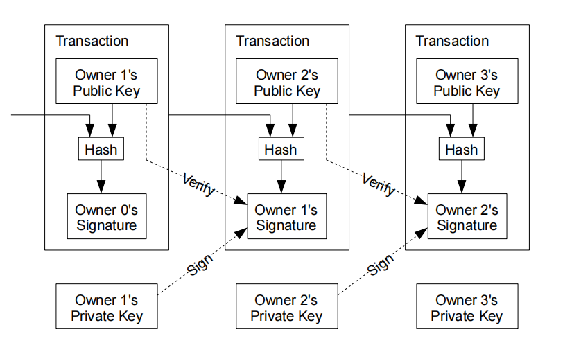
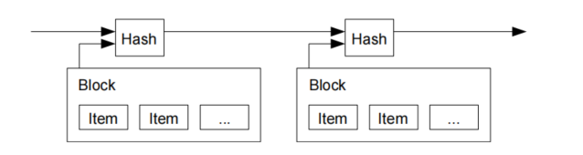
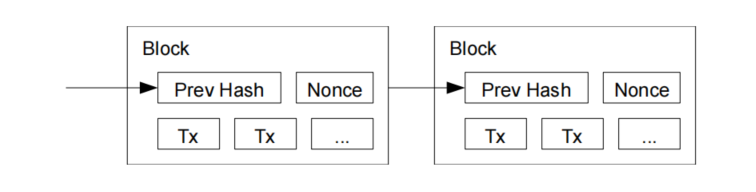
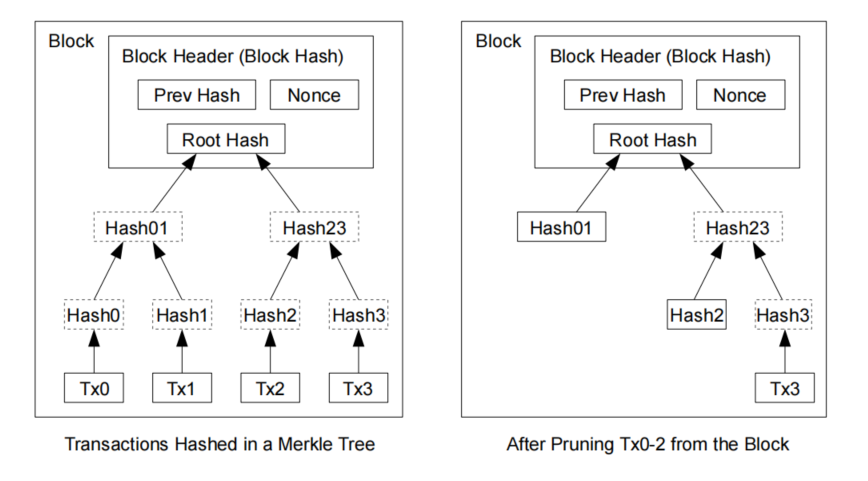
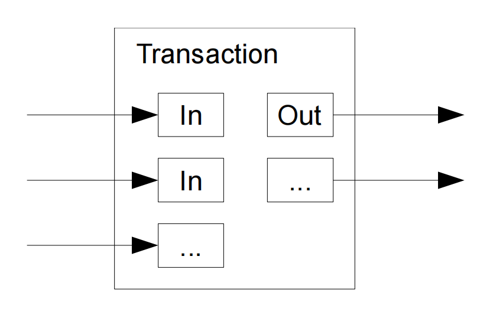

# 1. 比特币

[Bitcoin: A Peer-to-Peer Electronic Cash System](https://bitcoin.org/en/bitcoin-paper)

比特币网络使用一种分布式账本来记录所有交易，并且通过一种叫做“工作量证明”（Proof-of-Work）的机制来确保这个账本的一致性和安全性。只要网络的大部分算力不参与恶意行为，就可以维持一个不断增长、且被认可为有效的公共交易记录链。这个机制使得比特币成为了一种不需要中央机构即可运行的去中心化数字货币。

## 1.1 比特币原理

[比特币白皮书 个人翻译+注解 - 知乎 (zhihu.com)](https://zhuanlan.zhihu.com/p/25039679)

### 1.1.1 交易

假设现在A要给B一个coin，那么这个过程成为一个交易(transaction)(比如下图中的中间那个Tx)，这个交易记录给B多少coin，和B的公钥(指明目的地)，同时提供A可以操作上一个交易(如图中的第一个Tx。比如这个Tx记录的是X给了A一笔钱，那么相当于A可以操作X给A的这个交易的输出)，对这两个共同hash后，付款者A用自己的私钥签署这个hash，然后加在交易的上面。之后这个交易被广泛地**广播**道其他地方。此时作为一个旁观者(矿工)，是在自己**本地**具有第一个交易之前的所有交易的，所以看到这个交易(中间这个Tx)的时候，就可以用付款者A的公钥(指代的是图中第一个交易，A的公钥从第一个交易中获得)去验证这个交易(中间这个交易)的签名以证实这个交易是不是由付款者A本人发出的(因为私钥只有A持有，只有用A的私钥进行签署的签名才能和上一个交易(第一个交易)进行验证通过，证明A可以操作第一个交易，具备这笔从X转到A的钱)。这样就**证明**了这个交易是由付款人A发起的。

### 1.1.2 如何解决双重支付

首先是付款人才会发生双重支付，而收款人是担心付款人会不会干这件事情(废话，因为利益是由付款人转移到收款人上的)。“最早的交易才是重要的”这句话是说，双重支付发生的基础是，首先要已经发生过一个交易，然后付款人想无视这笔交易，再次使用这个交易已经用过的货币发起另一次交易。所以这个最早的交易指代的是“已经发生过的交易”。铸币厂并不关心想要发起双重支付的人的两笔(或以上)的交易哪笔是这个付款方认为先发生的，他只关心此刻这个付款方发起的这个交易是否“合法”(也就是之前这个人有没有已经用过这笔钱了)。所以是铸币厂确认哪个交易在前，而不是由付款人决定哪个在前的。那么此时的这个铸币厂并不归属任何一个第三方，那么这个交易就必须被“广而告之”，让所有参与进来的人都知道这件事情发生了，并且所有人都知道以前发生的所有“历史事件”来验证此时被广播的这个交易是否是合法的。但是我们知道，要让所有参与的人都保持一致是一件相当相当困难的事情，这也就是区块链所解决的问题。而最后一句话就是说收款人需要大多数人(超过51%)都认为那个交易是合法的了，那么才能说明这个交易是合法的。

**时间戳服务器(Timestamp Server)**

把一组数据打包成了一个区块(block)，并把这个区块加盖上时间戳并做hash，以此来保证时间的先后顺序，也就是要完成第2部分所介绍的“确保历史顺序”。而因为要得到这个hash是和当时的时间戳联系在一起的，所以这个hash就标识着时间了。因为这些区块是形成一个链条的，而区块的增长是CPU算力的证明(后文会描述)，所以因为hash->体现了时间戳->hash被链在一起->链上一个新的区块需要耗费CPU->所以之前的hash就一定是正确的(不断被加强可信度)。

### 1.1.3 工作量证明(Proof of Work)

该部分就是bitcoin区块链的另一个核心部分，就是广泛被人所知的PoW。在前面章节提到过首先A与B发生了一笔交易，然后这笔交易被广播，由于没有第三方，所以参与的人就是全网的所有节点。这些节点在收到这个交易和其他好多交易后，打包成为一个区块并加盖上了hash。那么现在的问题就来了，如果这些旁观的矿工都**分别**收到了很多交易消息并打包出了自己的区块，那么怎么保证全网达成共识呢？也就是假设C，D，E三个矿工都收到交易消息了，然后因为他们收到的交易消息不完全一致，收到的时间也不完全一致，那么产生的区块的hash肯定天差万别，有p2p经验的人都知道此时就需要保证C，D，E三个人最后需要达成共识，这样才能保证整个网络都认同同一个区块链所发生的“历史事件的顺序”，否则整个体系将会毫无用处。而中本聪在这里的方式就是引入了POW来让C，D，E三个人用付出”CPU算力“的途径去以概率性成功的方法去**抢夺**记录区块的权利(也就是俗称的**”记账权“**)。原文中的scan就是指暴力枚举。因为对于SHA-256来说，以目前的密码学来说，要达到某个符合的条件，只有进行暴力枚举的方式去获得，显然，”暴力“的快慢，是由CPU的计算能力决定的，而要暴力的规模，就是这个POW机制的”难度“。因为要枚举出这个值是以”概率性“的事件(想象一下去猜测一个不知道密码的压缩文件会怎么暴力破解)，但是因为要经过相当多次枚举，最后平均下来，得到的结果确实可衡量的(也就是概率的**期望值**，在有些矿池把这个近似的叫幸运值？不太确定)。

对于这个区块”猜测“得到的那个满足要求的值的方式就是改变这里的nonce。(因为对于散列函数来说，只要做一点小的改动，结果就会完全不同。获得满足要求值得方式就是不断变换nonce使得整个区块的hash满足难度要求)所以这个nonce就代表了当前这矿工，为了夺取到这一轮区块的”记账权“，所付出的劳动(CPU算力，电费)的**”证明“**。所以可以直接把nonce看作是”劳动(工作量)的证明“。假如区块中有更改，那么这个hash就被更改了，那么就需要重新计算这个区块的nonce，也就是要改变前面的区块，那么你要把要改的这个区块一直到目前这轮所需要的区块全部都计算过来(付出需要的全部劳动)才可做到。

> 一个区块是包含上一个hash的(Prev Hash)，并且Nonce是区块中的一个部分。一旦更改Nonce，Prev Hash, Tx其中任意一个，那么这个区块的Hash也会改变，之后的区块也全部都要改。

工作量证明同时解决了多数决策中决定代表的问题。如果大多数人只根据一人一ip进行投票(one-IP-one_vote)，这样会被任何能够分配很多ip的人破坏。工作量证明本质上是一CPU一票(one-CPU-one-vote)。主要的(大多数)的决定是由最长的链所代表，最长链拥有最大的工作量花费在其中。如果一个大多数CPU算力都被诚实节点所控制，那么最诚实的链就会增长的最快且超过其他任何计算链。想要改变一个过去的区块，攻击者需要重做这个区块和所有在这个块后的区块的工作量证明，之后还要追赶上并超过现在所有诚实节点的工作。

PoW的难度是随整个系统的难度而一起提升的，因为计算机计算的硬件能力是不断提升的，想想现在的CPU挖矿->显卡挖矿->矿机挖矿，这就是PoW的精妙之处。但是这同样也带来了一个对bitcoin不看好的一个理由：现在的计算机算力因为参与的人太多，而难度提升的很大，整体的算力也水涨船高，近年更是呈指数增长。那么要是过了若干年后，bitcoin的激励(后文提到)所产生的效果不能承受这么高算力的代价，是否会造成算力的断崖式下跌？随之带来的是bitcoin信用的崩溃(能够被掌控算力的人攻击)而导致bitcoin最后突然崩盘？

bitcoin的”最大规则“，也就是所有人都默认最长链是正确的。如果这条不能保证，那么可想而知整个系统是不能工作的。而这个最长链是正确的是由后文的”激励机制“所保证的，所以这里就出现了一个博弈场景：如果现在要创建一个区块链应用，那么要么要所有人能够公认一个规则(强制力)，那么要用某些方法使人们能够自主的认同一个规则(激励)，但是总之因为争夺区块是要产生代价的，如何在对这个代价进行”强制力/激励“进行博弈，就是一个区块链是否能健康成长的关键。

一个区块真正能够**被承认的关键**：有矿工(大部分)以这个区块为prev区块，并为它构成的hash纳入新的一个区块并为新的区块工作，那么这个区块才是被承认的。所以这里指明，只有产生的下一个区块，当前的这个区块才是**”合法的“**。这条相当关键，因为所有的攻击都会指向这个问题，同时收款者与付款者的不平衡点也是这里所导致。同时这里也是区块链运用博弈论的精华体现。

新交易的广播到所有的节点上是不必要的。只要交易到达了许多节点上，它们就会进入到一个区块中(在最长的区块中(beforelong))。区块广播是有容忍丢失信息的能力的。如果一个节点没有收到一个块，它就会在收到下一个块的时候发现缺失了它并请求这个丢失的块。

### 1.1.4 激励机制(Incentive)

按照惯例(进行约定)，一个块中的第一个交易是一个特殊交易，它由这个块的创造者拥有一个新货币起始。这样提供了一种激励机制让节点们能够支撑这个网络，并且提供了一个方式来初始化的分发货币进入整个系统当中。因为没有一个中央授权机构来发布他们(货币)。稳定增加一定数量的新货币类似于黄金矿工花费资源开采黄金并引入循环系统当中。

> 在bitcoin的系统中，中本聪已经规定了总量就是2100W个bitcoin。而这些bitcoin的产生是每产生21000个区块就减半(以现在约定大约每10分钟产生一个区块的速度大约到2140年产生为0)。而bitcoin产生的方法就是给抢到记账权的人凭空给予一定量的货币，这样就同时解决的货币发行和矿工记账的奖励(就像现实中挖黄金的黄金矿工一样)。这这种凭空奖励的方法，就是每个区块的第一交易，是一个特殊的交易，这个交易就是只有Input，且对于输入这个input的output(前一个交易的output)是个空(后文会提到)。因为在第2章的注解中已经说到，coin是不存在的，coin是由tx推断出来的。就像A给B 100块钱，在记录这个信息的时候可以记录A的“账户-100，B的账户+100”这个事物，也可以记录”A给了B 100块钱“这一条交易信息。区块链选择了后者。而这个凭空出现的钱，就是一条特殊的交易信息。

这种激励机制同样可以以交易手续费的方式奖励。如果一个交易的输出值小于其输入值，那么这个差值就是交易的手续费，手续费被附加到包含这个交易的区块的奖励中。一旦一个已决定数目的货币(所有货币)进入这个循环中，这个激励机制就可完全的转变为交易手续费并且本系统可以完全避免通货膨胀(货币总数一定，没有发行货币)。

### 1.1.5 回收硬盘空间(Reclaiming Disk Space)

一旦一个货币最新的交易收入(buried)进入足够的区块中，那么在这个交易前面被消费过的交易就能够被抛弃来节省硬盘资源。为了同时确保不损害区块的hash，交易被hash为一棵Merkle Tree，这个Merkel Tree只有root节点被包含进了这个区块的hash。老的区块能够通过将这个树的分支进行拔除(stubbing off branches of thetree)而被压缩。

> 这段是针对区块链系统会不断产生的区块问题的一个解决方案。如截止目前为止(2017/1/28)，区块链总数已经超过了90G，虽然存储是越来越不值钱了，但是要普通公众使用是不可能的，因为信息在一直膨胀。这里就体现出区块链系统的精妙之处，它不存储交易，而是使用Merkel Hash Tree的方式存储Root Hash，达到”0知识证明“。个人并不一定需要这个区块，而是具有这个区块的”hash“(索引)就足够了，有IPFS，公共节点，信任度高节点帮助存储这些区块。”0知识证明“保证了区块是绝对正确的而不是伪造的。

### 1.1.6 简化支付认证( Simplified Payment Verification )

认证支付不需要运行所有的网络节点是可能的。一个用户只需要保存最长工作量证明链的区块头部的拷贝就行，这条链他只需要查询网络节点直到他确信他拥有最长链为止，并能够通过merkle的分支连接到它(这个用户的交易transaction)被加上时间戳的那个区块中的那次交易。他无法自己检查这笔交易(因为只有hash)，但是通过连接到链中的位置，他可以看到一个网络节点曾经接受过它(那笔交易)，并且在它后面增加的区块也进一步证明网络曾经接收过它。

> 用户自己没有完整的区块，但是有hash链，可以看到别的节点接受过这笔交易

### 1.1.7 组合和分割价值(Combining and Spliting Value)

一个交易(Tx)的构成：一个交易是由前面的交易进行验证，加上转移的数目和目的地构成。inputs就是之前的交易的outputs。对所有的inputs进行验证，就可得到该交易的付款者的余额是否大于要转移的数目。inputs关联的所有Tx就是之前的”历史信息“，节点可检索自己的区块获得结果。每个区块的第一个交易(激励交易)就相当与只有Input而没有output。

这里要注意的额外一点就是：每次的交易必须被花完，只不过是所有input的综合，其中一部分给了收款方，而找零则是全部返回到购买者上(回想下前文阐述的铸币厂的工作流程)。这种机制在数目的分割上有天然优势。现有的货币总是有一个最小单位作为”元“单位(比如人民币：1分)，但是bitcoin却没有这样的限制，它只关心差额，而不关心最小元单位。所以这就是价值的组合和分割。

### 1.1.8 隐私

1. **匿名地址（Pseudonymity）**: 比特币使用加密货币地址来表示发送方和接收方。这些地址是随机生成的一串字符，不直接包含任何个人识别信息。因此，虽然交易是公开的，但是很难直接将交易中的地址与真实世界的个人或实体连接起来，除非这些信息另外被披露。
2. **每次交易使用新地址（Address Reuse）**: 用户可以为每次交易生成新的地址。这样做可以增加追踪交易历史和确定身份的难度，因为将多个地址与同一个用户关联起来变得更加复杂。