# 传统金融介绍

## 金融问题

1.个人投资：在不同的时间和可能的情况（状态）下积累财富

2.商业投资：为企业家和企业提供投资生产性活动的资源

目标：跨越时间和状态有效地分配所有资源

### 状态

状态是对可能发生的事情的描述，区分为两种状态：①影响每个人的状态②只影响少数人的状态

### 当前系统如何解决这个问题

- 金融资产（股票、债券、保险）是一种契约，它规定了真实资源在现实世界中的分配
- 法律制度允许这些合同被执行
- 监管机构监督这个系统

### 监管

- 天真的投资者在参与时不应该受到伤害，例如美国证监会（SEC）
- 系统不应被不良行为者利用，了解你的客户(KYC),反洗钱(AML)
- 系统不应该创造自身风险：银行资本监管，保险资本监管

### 评估金融系统

- 直截了当比较两个我们可以观察到的系统
- 我们没有观察到的成本和收益仍然需要被评估
  - 未发生的交易：如果交易提升效用，不交易则是丧失机会
  - 系统风险的积累：系统风险很少被观察到，但是事件风险随时间增大
  - 交易利益分配不均：垄断者扭曲价格

如果满足以下条件，金融系统运行良好：

- 商品被分配给最看重它们的人
- 人们愿意参与该系统
- 监管机构确保“溢出”得到管理，符合每个人的最大利益

## 标准金融工具

一些常用金融工具

- 债券或固定收益
- 股权或股票
- 衍生品：比如期权
- 延时合约：比如远期和期货

收益均随着时间和状态的变化而变化

### 债券

一种随时间获得收益的投资。

债券或固定收益证券通常每期偿还固定金额，直到本金偿还

### 期货和远期

现在购买，后期付款。

今天同意在未来以20美元的价格交易，在未来无论价格多少，都以20美元价格购买

### 股票

随着时间和状态而获得收益的投资。

- 永久获得收益的永久债权
- 股票的收益称为股息
- 股息支付是可自由支配的，取决于公司是否表现良好
- 状态取决于公司的财富

### 期权

从股价衍生的收益。

#### 看涨期权

支付10美元，获得以5美元的价格购买股票的权力，任何时候的收益都是当前价格-5美元

#### 看跌期权

支付10美元，获得以5美元的价格售卖股票的权力，任何时候收益都是5美元-当前价格

### 保险

对特定风险产生收益

保费为5美元的保险合同，如果您的房屋损坏，该保险合同将得到偿付

## 金融资产属性

### 价值可加性

金融资产是可组合的，如何划分/累加资产不会影响其价值

一些资产还嵌入了金融系统的其他部分

## 谁在进行交易

### 散户/投资者

厌恶风险：更喜欢对有着一样期待值的不确定事物有个确切的假设

不会因为超前的信息进行交易

时常持有低效的投资组合

- 不会合适地多样化准备
- 买到错误地资产类别

面临极高的交易费用（隐性【交易摩擦费、资产机会成本低】和显性【亏钱】的）

做太多交易

### 对冲基金和机构

老练且有见识的，会使用各种金融工具使收益最大化

对冲基金通过募集投资者的资产来制作不同投资风险和回报的投资组合( Hedge Funds take investor capital and produce  different risk and return profiles.)

（经常）对（合法的）私人信息进行杠杆押注

- 杠杆就是借钱投资
- 杠杆增加了风险和回报

## 杠杆

做杠杆的最简单方法是借钱投资

老练的投资者使用衍生证券

- 衍生证券的价值与标的资产有关
- 例如期权、期货、差价合约

通常，衍生品交易需要初始保证金，作为抵押品的安全资产

## 人们如何交易

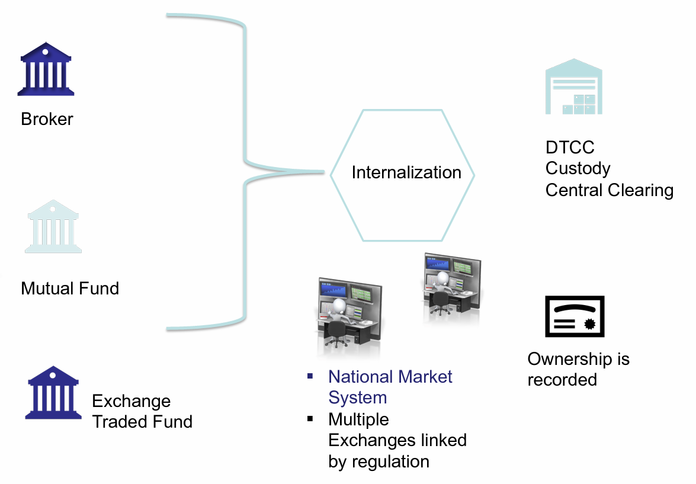

### 限价订单市场

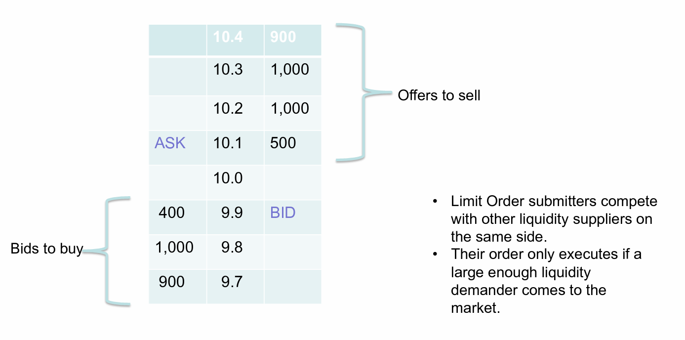

### 交易成本

在一个理想化的世界，交易在物品的基本面价值上发生，但是无法观察到基本面价值

（竞价(bid)+询价(ask)）/ 2 = 中点价格

立即购买的成本：询价 - 中点价格

价差 = 竞价 - 询价

### CCP机制（TODO：不太懂）

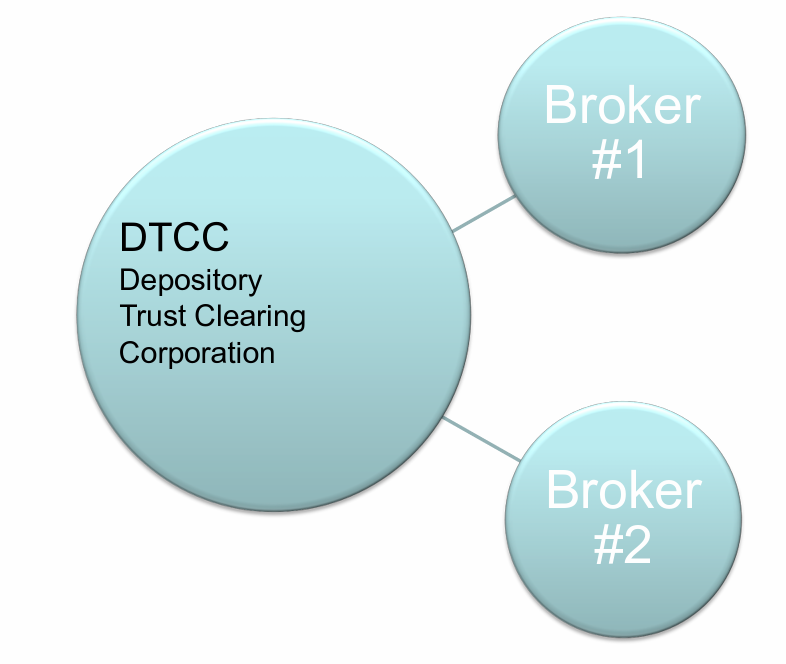

- 每一天，参与者基于交易量发布保证金
- 全天交易净额，保证金可能会增加
- 保证金为任何一方失败提供保险
- 中央清算允许交易净额（相对于总流量）

# 去中心化交易所

## 交易所架构

## 两种订单簿模型

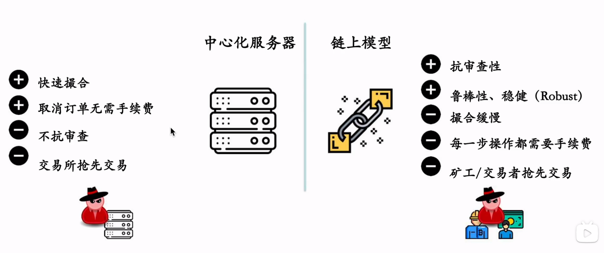

从订单簿模式的DEX中学到的

优势：

- 没有KYC(身份认证) / AML(反洗钱)
- 不需要给交易所支付费用
- 无无偿损失

缺陷：

- 交易的创建、取消，资金的存取都需要链上手续费
- 执行缓慢
- 并非完全去中心化（中介服务器）

## 自动化做市商

AMM-自动做市商，让智能合约来做市商

X * Y = K

性质：

- 即时流动性，无论交易规模如何
- 购买资产X会提高X的价格和降低Y的价格
- X和Y的资产量决定了价格
- 称为恒积AMM
- 一个资产X减少（买入），另一个资产Y需要增加（卖出），导致X的价格上涨，Y的价格下跌

### 预期滑点

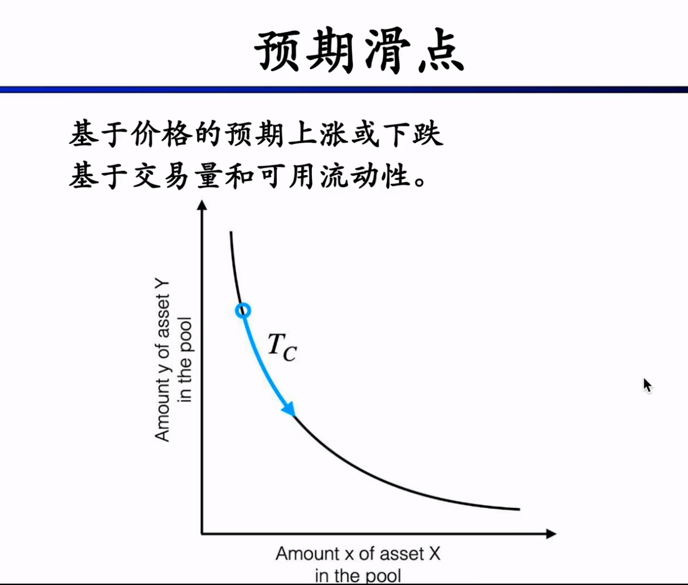

如果流动性差，那么少量的交易可能就会造成曲线滑点

### 滑点保护

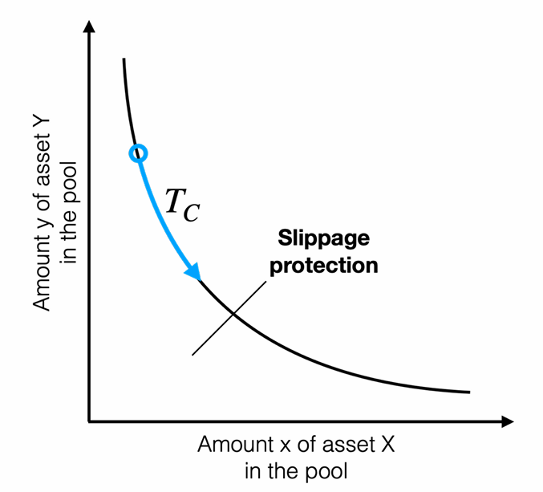

配置滑点保护阈值以防止不可接受的滑点

### 优点和缺点

优点：

- 无订单簿维护，不需要买单和卖单。如果想要价格调控，则需要套利者
- 实现简单，gas手续费比较低

缺点：

- 无常损失/币价脱钩的危险，资金可能全部流失
- 低流动性市场的高滑点
- 用户容易遭受三明治攻击

## 锚定和稳定币自动做市商

### 稳定币的类型

- 基于储备的
- 基于抵押的
- 基于算法的（不太稳定）

## Curve协议（重要,多看看白皮书）

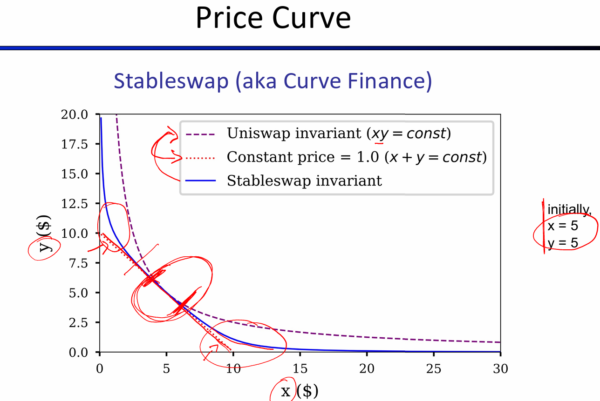

Curve曲线将x*y=k和x+y=k曲线进行融合，使得滑点更平滑，降低流动性需求

## 流动性挖矿==激励

在defi矿池中的两种激励

- 交易手续费
- 流动性挖矿奖励

## DEX聚合器

我在哪里可以得到最好的交易价格？

最深的流动性在哪里？

两种类型的聚合器：

- 链外聚合器（1inch，paraswap）
  - 好处：能生成多个链，非常灵活
  - 坏处：操作员可以领先用户
- 链上聚合器（swapswap）
  - 好处：原子性路径选择&套利
  - 坏处：不太可能有效覆盖4个以上交易所

## AMM无常损失

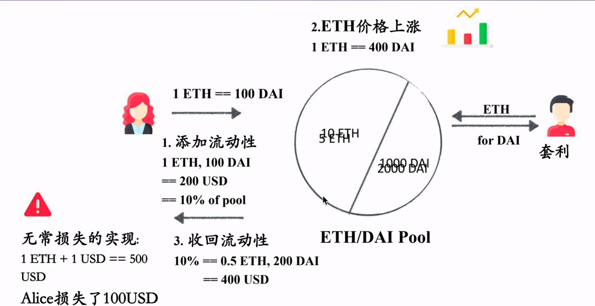

因为代币价格的上涨和下跌，造成流动性提供者的损失，是套利者套利的动力

无常的==非永久的：仅在提款时实现

无常损失可能导致全损

可能的解决方案：改变边际曲线

## 如何找到Defi中的交易机会

### 贝尔曼福特算法（DeFiPoser-ARB）

负循环检测

适用于多个市场

在传统金融和Defi中都被广泛使用

### 定理求解器（DeFiPoser-SMT）

需要对defi模型编码

需要应用一些启发式算法来进行路径修剪

# 借贷

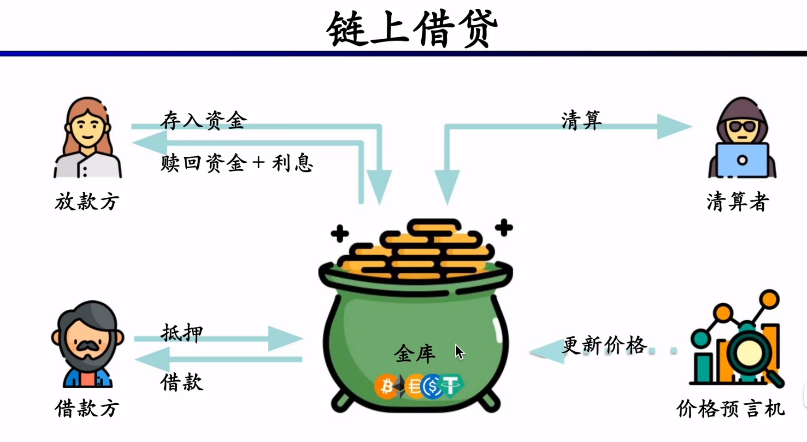

## 术语

杠杆：债务乘数

抵押物：作为保证金的资产

超额抵押：借款人必须提供价值（抵押资产）>价值（授予借款）

抵押不足：价值（抵押物）< 价值（借款）

清算：抵押物价值<=150%*借款价值，任何人都可以清算债务

清算价差：清算人在清算抵押物时可以收取的补贴、折扣

## 健康因子

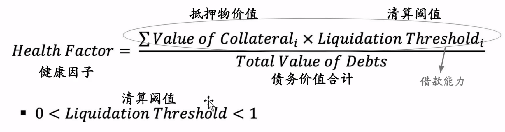

健康因子小于1，变为可清算

在最新的借贷协议中，清算是有缓冲时间的

## 抵押不足的借款

债务的价值超过抵押物的价值，借款会被限制使用

## 清算

清算==卖掉借贷人的抵押物

清算价差：

- 奖金，或者给清算人折扣
- 固定价差，或者变动的（基于拍卖）

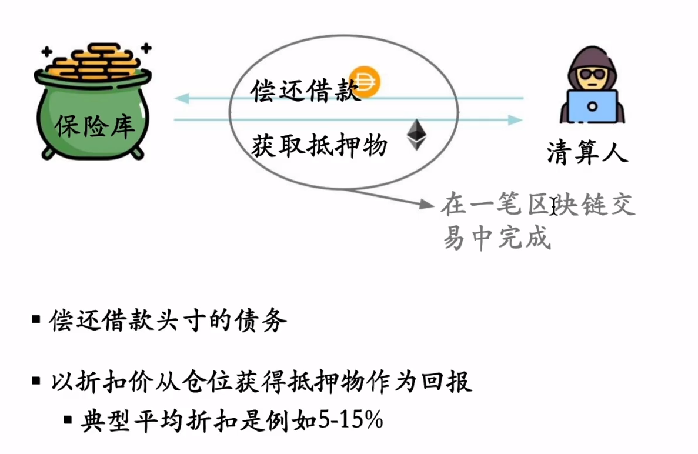

### 拍卖清算

各种清算人随时间推移出价，直到拍卖终止

需要多条区块链交易

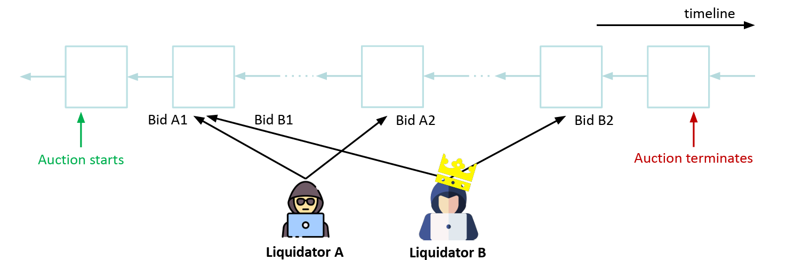

英式拍卖：投标人出价越来越高

荷兰拍：拍卖以高要价开始，价格随时间下降直到拍卖终止，原子交易，即时结算

英式拍卖：d为债务，c为抵押品

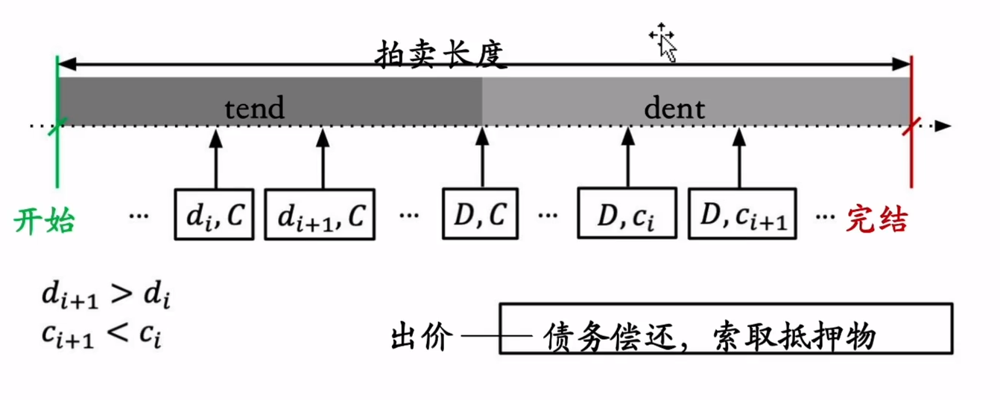

荷兰拍：

- 即时结算
- 不需要预付债务
- 价格作为时间的函数，抵押物价格随时间下降

## 闪电贷

在一次交易中放贷并还清，如果没有最后还清步骤，则相当于没有这笔交易

使用案例：

- DeFi攻击，价格预言机操纵
- 无风险套利
- 倒仓
- 闪铸
- 抵押物替换